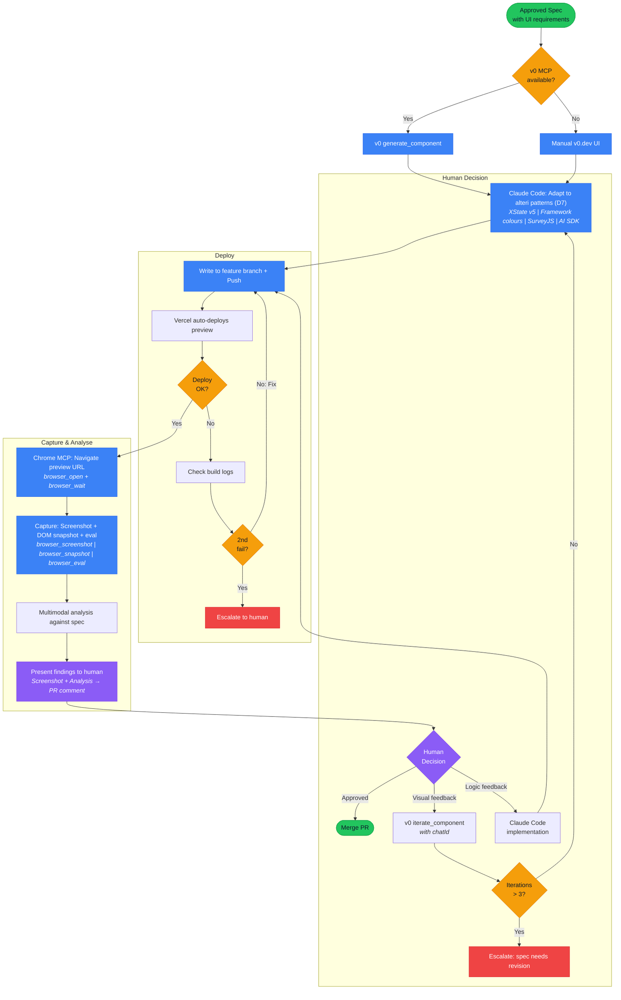

# CIA-259: Visual Feedback Loop — Core Iteration Loop

```mermaid
flowchart TD
    Start([Approved Spec<br/>with UI requirements]) --> D1{v0 MCP<br/>available?}

    D1 -->|Yes| V0[v0 generate_component]
    D1 -->|No| Manual[Manual v0.dev UI]

    V0 --> Adapt
    Manual --> Adapt

    Adapt["Claude Code: Adapt to alteri patterns (D7)<br/><i>XState v5 | Framework colours | SurveyJS | AI SDK</i>"]

    subgraph Deploy ["Deploy"]
        Push[Write to feature branch + Push]
        Vercel[Vercel auto-deploys preview]
        D2{Deploy<br/>OK?}
        Logs[Check build logs]
        D3{2nd<br/>fail?}
        Escalate1[Escalate to human]

        Push --> Vercel --> D2
        D2 -->|No| Logs --> D3
        D3 -->|Yes| Escalate1
        D3 -->|"No: Fix"| Push
    end

    Adapt --> Push

    subgraph Capture ["Capture & Analyse"]
        Navigate["Chrome MCP: Navigate preview URL<br/><i>browser_open + browser_wait</i>"]
        Screenshot["Capture: Screenshot + DOM snapshot + eval<br/><i>browser_screenshot | browser_snapshot | browser_eval</i>"]
        Analysis[Multimodal analysis against spec]
        Present["Present findings to human<br/><i>Screenshot + Analysis → PR comment</i>"]

        Navigate --> Screenshot --> Analysis --> Present
    end

    D2 -->|Yes| Navigate

    subgraph Decision ["Human Decision"]
        HD{Human<br/>Decision}

        HD -->|Approved| Merge([Merge PR])
        HD -->|Visual feedback| Iterate["v0 iterate_component<br/><i>with chatId</i>"]
        HD -->|Logic feedback| Logic["Claude Code<br/>implementation"]

        Iterate --> D4{Iterations<br/>> 3?}
        D4 -->|Yes| Escalate2[Escalate: spec needs revision]
        D4 -->|No| Adapt

        Logic --> Push
    end

    Present --> HD

    style Start fill:#22c55e,stroke:#16a34a,color:#0f172a
    style Merge fill:#22c55e,stroke:#16a34a,color:#0f172a
    style Escalate1 fill:#ef4444,stroke:#dc2626,color:#fff
    style Escalate2 fill:#ef4444,stroke:#dc2626,color:#fff
    style HD fill:#8b5cf6,stroke:#7c3aed,color:#fff
    style Present fill:#8b5cf6,stroke:#7c3aed,color:#fff
    style Adapt fill:#3b82f6,stroke:#2563eb,color:#fff
    style V0 fill:#3b82f6,stroke:#2563eb,color:#fff
    style Manual fill:#3b82f6,stroke:#2563eb,color:#fff
    style Push fill:#3b82f6,stroke:#2563eb,color:#fff
    style Navigate fill:#3b82f6,stroke:#2563eb,color:#fff
    style Screenshot fill:#3b82f6,stroke:#2563eb,color:#fff
    style D1 fill:#f59e0b,stroke:#d97706,color:#0f172a
    style D2 fill:#f59e0b,stroke:#d97706,color:#0f172a
    style D3 fill:#f59e0b,stroke:#d97706,color:#0f172a
    style D4 fill:#f59e0b,stroke:#d97706,color:#0f172a
```
